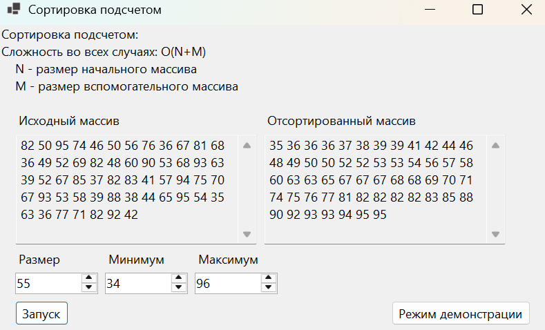
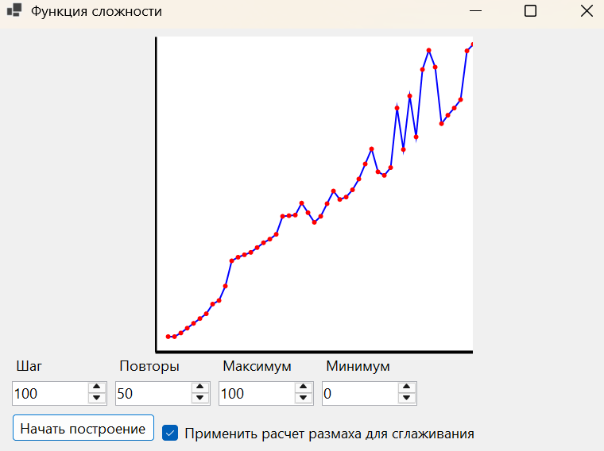

# Вступление
Проект CountSortGUI создан для изучения сортировки подсчетом и правильного построения архитектуры приложения. Написан на C# .NET 8, WinForms. Представляет обычный режим сортировки и демонстрационный режим для визуализации временной сложности алгоритма.

# Сортировка подсчетом
Алгоритм не использует сравнения, а ведет подсчет повторяющихся элементов. Сложность во всех случаях - O(**n**+**m**), где **n** - размер входного массива, **m** - размер вспомогательного массива. Благодаря обходу в противоположном порядке, сортировка стабильна.

# Форма с сортировкой

Числовые поля ввода позволяют параметризировать тестовый массив. Результат отображается мгновенно с возможностью сравнения массивов через перемещение ползунка. Интерфейс обеспечивает переход на форму с графиком.

# Форма с графиком

Настройки позволяют задать шаг измерений, количество точек и разброс значений. Опция сглаживания устраняет выбросы: сравнивает точки со средним значением и заменяет аномалии средним между соседними точками. График отображает точки с соединением линиями, включает координатные оси.

# Пользовательские элементы
+ **RangeCalc** - класс для сглаживания экспериментальных данных
+ **DataGenerator** - класс генерации тестовых массивов
+ **GraphController** - контроллер отрисовки осей и графика
+ **CountingSort** - реализация сортировки подсчетом
+ **ISortAlgorithm** - интерфейс для алгоритмов сортировки

# Заключение
Проект демонстрирует практическую реализацию алгоритма сортировки подсчетом с визуализацией его работы. Архитектура спроектирована с соблюдением принципов, что обеспечивает модульность и расширяемость кода. Интерфейс позволяет наглядно изучать свойства алгоритма и его временную сложность на различных наборах данных.
